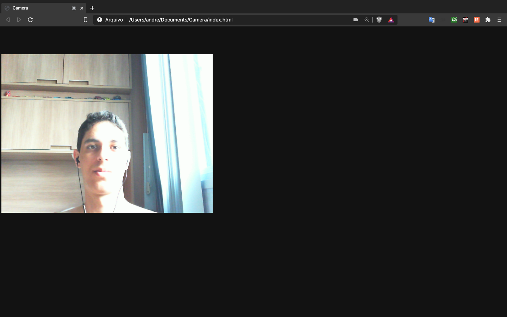

# Camera na página Web

Às vezes precisamos testar uma webcam no computador, mas não temos um software para isso. 
Ao invés de baixar um programa só pra testar isso, você pode simplesmente abrir esse html que sua imagem 
da camera será exibina na hora.

## Exemplo do funcionamento:

<h1 align="center">
    
</h1>
